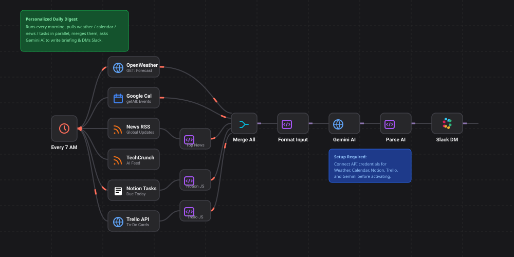
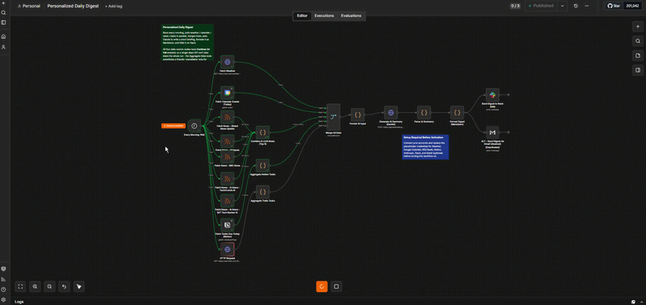
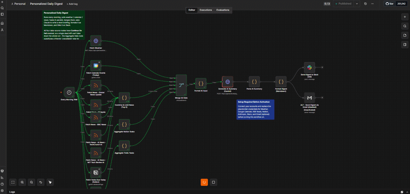

<div align="center">

  

  <br/><br/>

  [](https://n8n.io/)
  [](https://gemini.google.com/)
  [](https://slack.com/)

  <p align="center">
    <b>An automated backend workflow engineered to synthesize multi-source daily intelligence into actionable Slack briefs.</b>
  </p>

</div>

---

### ⚡ System Architecture
  

```text
               ┌────────────────────────┐
               │  OpenWeather API       │
               ├────────────────────────┤
               │  Google Calendar       │
 ⏰ Every Morning ──►  News RSS Feeds      ├───► [ Merge JSON ] ──► [ Gemini 2.5 AI ] ──► [ Markdown Parser ] ──► [ Slack DM ]
    7:00 AM    ├────────────────────────┤
               │  Notion Tasks API      │
               ├────────────────────────┤
               │  Trello REST API       │
               └────────────────────────┘
```

<!-- Workflow Engineering Steps Header -->
<h2>🛠️ Workflow Engineering Steps</h2>

<p>This project was developed end-to-end starting from a local development environment. Below are the steps taken to achieve the fully functional automation pipeline:</p>

<ol>
  <li>
    <strong>Local Environment Setup (n8n on Localhost):</strong>
    <ul>
      <li>Initialized and launched <code>n8n</code> locally using Node.js via <code>npx n8n</code> for rapid local development.</li>
    </ul>
  </li>
  <li>
    <strong>Workflow Initialization &amp; Strategy:</strong>
    <ul>
      <li>Created a new n8n workflow and set up a <strong>Cron Trigger</strong> node to schedule execution automatically every morning at 7:00 AM.</li>
      <li>Designed the parallel-execution strategy using <strong>Merge</strong> nodes to prevent network bottlenecks during data aggregation.</li>
    </ul>
  </li>
  <li>
    <strong>API Credentialing &amp; Connection:</strong>
    <ul>
      <li>Systematically registered and connected API keys/OAuth credentials within n8n's secure credential manager for all five core data sources:</li>
      <ul>
        <li>OpenWeatherMap</li>
        <li>Google Calendar</li>
        <li>RSS Feeds</li>
        <li>Notion</li>
        <li>Trello</li>
      </ul>
    </ul>
  </li>
  <li>
    <strong>Data Source Engineering &amp; Resiliency:</strong>
    <ul>
      <li>Built out each data-fetching node, configuring specific API endpoints and query parameters.</li>
      <li>Activated the <code>Continue On Fail</code> setting for all five nodes to ensure a healthy fallback if any single API failed or timed out.</li>
      <li>Developed the custom JavaScript logic required to resolve Trello board metadata and filter specific list IDs from raw API responses.</li>
    </ul>
  </li>
  <li>
    <strong>AI &amp; Data Formatting:</strong>
    <ul>
      <li>Connected the <strong>Google Gemini AI</strong> node via its API key and engineered structured prompt templates to handle the incoming daily data.</li>
      <li>Optimized Gemini's context window to enforce conversational natural-language briefs alongside strict Markdown bullet-point formatting.</li>
    </ul>
  </li>
  <li>
    <strong>Slack Integration &amp; DM Delivery:</strong>
    <ul>
      <li>Configured the <strong>Slack Webhook</strong> to point to the correct user DM.</li>
      <li>Programmed a custom payload builder to translate the synthesized AI output directly into Slack-native dynamic blocks.</li>
    </ul>
  </li>
  <li>
    <strong>Testing &amp; Deployment:</strong>
    <ul>
      <li>Conducted multiple manual executions of the workflow, validating error fallbacks by purposefully deactivating certain API keys.</li>
      <li>Monitored n8n execution logs to verify JSON structure integrity before final activation.</li>
    </ul>
  </li>
</ol>

<!-- Tech Stack & Integrations Header -->
<h2>🛠️ Tech Stack & Integrations</h2>

<p>Below is a breakdown of the key architecture milestones and technical insights gained while building this workflow:</p>

  
  

<!-- Key Achievements Callout Section -->
> [!NOTE]
> ### 🚀 Key Achievements
> 
> * **Multi-Source Data Aggregation:** Designed parallel API execution branches to cleanly merge 5+ disparate endpoints into a single unified JSON payload.
> * **Trello REST API Filtering:** Dynamically resolved board structures, isolated targeted list IDs (`🎯 To do`), and filtered card metadata using custom JavaScript algorithms inside n8n Code nodes.
> * **Resilient Pipeline Architecture:** Implemented `Continue On Fail` logic across all data-fetching endpoints to ensure network drops or dead APIs gracefully output fallback notifications instead of breaking downstream AI/Slack delivery.
> * **AI Synthesis & Dual Formatting:** Engineered Gemini AI prompts to deliver an engaging conversational intro while programmatically maintaining distinct list structures for Notion Tasks and Trello To-Do Cards.

<br />

<!-- What I Learned Code Section -->
### 💡 Core Takeaways

```typescript
interface DeveloperLearnings {

  n8nWorkflow: "Mastered parallel branch orchestration, custom code data transformation, and state handling across complex workflow nodes.";
  
  apiIntegration: "Handled custom REST endpoints, authentication keys, dynamic URL parameters, and list/board metadata extraction.";
  
  promptEngineering: "Optimized LLM context windows to strictly enforce word limits, tone constraints, and structural output formats.";
  
  markdownParsing: "Built custom JS formatting scripts tailored specifically to Slack's block and Markdown rendering engine.";
}

```
Developed by 🙋‍♂️ [Eddie Ooi](https://github.com/EddieOoi)
